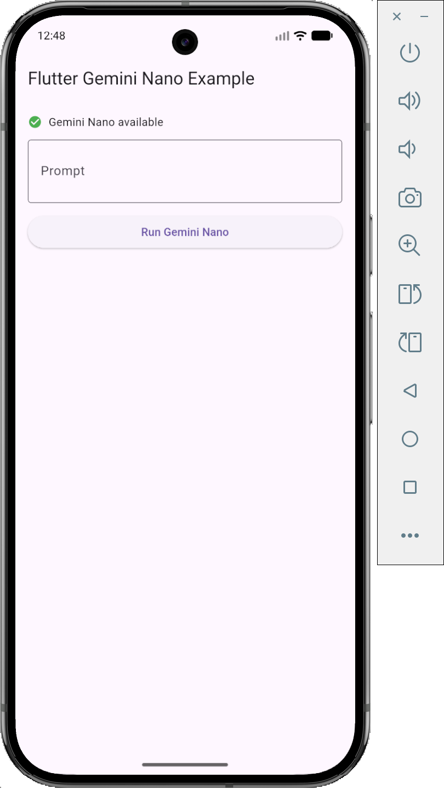
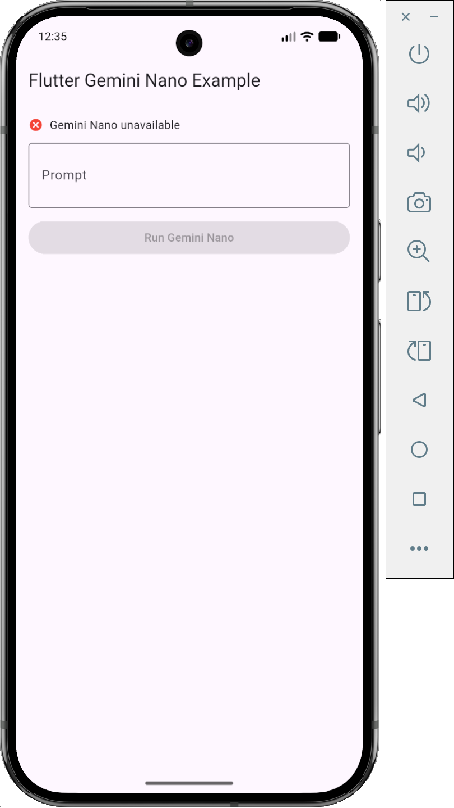

[Buy Me A Coffee ☕](https://buymeacoffee.com/malexandrej)

# flutter_gemini_nano

Plugin Flutter para uso do **Gemini Nano (on-device)** via **Google ML Kit GenAI**,
permitindo **geração de texto e multimodal (texto + imagem)** **diretamente no dispositivo Android**,
sem necessidade de chamadas para servidores externos.

✅ Processamento local  
✅ Privacidade por design  
✅ Ideal para apps offline ou sensíveis a dados  

---

## ✅ Status do projeto

`flutter_gemini_nano` **2.0.0** é a primeira versão oficialmente **estável** do plugin.

- ✅ API estabilizada
- ✅ Documentação completa
- ✅ Pronto para produção
- ✅ Inferência 100% on-device

---

## ☕ Support the project

Se este plugin te ajuda de alguma forma, considere apoiar o desenvolvimento contínuo ☕  
Isso ajuda a manter o projeto atualizado e evoluindo.

---

## ✨ Funcionalidades

- ✅ Geração de texto usando **Gemini Nano**
- ✅ Suporte a **prompt multimodal** (texto + imagem)
- ✅ Processamento **100% on-device**
- ✅ Download automático do modelo quando necessário
- ✅ Detecção e tratamento de dispositivos não compatíveis
- ✅ API Dart **simples, segura e fortemente tipada**
- ✅ Tratamento de erros consistente entre Dart e Android

### ⚙️ Parâmetros de geração suportados

- `temperature`
- `topK`
- `seed`
- `candidateCount`
- `maxOutputTokens`

---

## 📱 Plataformas suportadas

| Plataforma | Suporte |
|-----------|--------|
| Android | ✅ Sim (Gemini Nano) |
| iOS | ❌ Não |
| Web | ❌ Não |
| Desktop | ❌ Não |

> ⚠️ O **Gemini Nano** está disponível apenas em **dispositivos Android compatíveis**  
> e requer suporte ao **Google ML Kit GenAI** no próprio dispositivo.

---

## 🔍 Disponibilidade do Gemini Nano

Antes de executar qualquer inferência, você pode verificar se o **Gemini Nano**
está disponível no dispositivo usando a API `isAvailable()`.

### Estado do dispositivo

| ✅ Disponível | ❌ Indisponível |
|--------------|---------------|
|  |  |

> ℹ️ Em dispositivos não compatíveis, o plugin retorna um estado seguro  
> e impede a execução da inferência.

---

## 📦 Instalação

Adicione ao seu `pubspec.yaml`:

```yaml
dependencies:
  flutter_gemini_nano: ^2.0.0